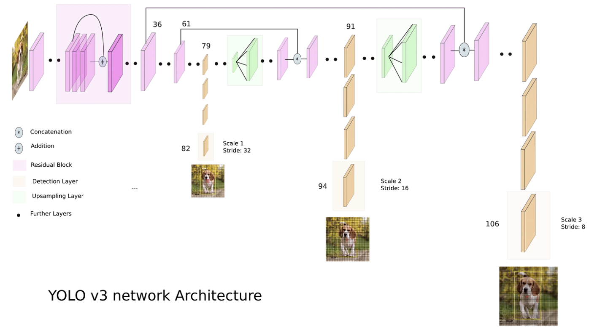

# Object-Detection-on-COCO-dataset-YOLOv1-YOLOv3
The repo will host the playground of object detection using yolov1 and yolov3 on COCO dataset. 
## Network - YOLOv1
<figure>

  
</figure>

## Network - YOLOv3
<figure>

  
</figure>
