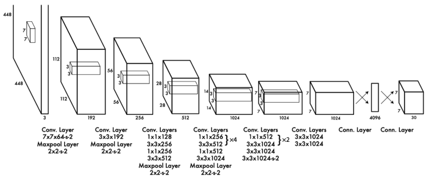

## Summary
It is a side project in 2023. The project is a Computer Vision topic. The languages and relevent packages are **Python - Pytorch**. The repo built the Yolov1 to detect the defects in SEM images. 
## Data
PASCAL VOC, [source](http://host.robots.ox.ac.uk/pascal/VOC/)
## Network
YoLov1. The network is a convolutional network. The prediction is a grid prediction. The cell in the grid has (num_classes + 5) outputs, 5 is (objectness, x, y, w, h)
<figure>

  
</figure>

## Loss
Loss consists of four loss, box coordination loss, box size loss, object loss, no object loss and class loss. 

$$ Loss = \lambda_{coord}\sum_{i=0}^{S^2} \sum_{j=0}^{B} 1_{ij}^{obj}\Big[(x_i - \overline{x}_i)^2 + (y_i - \overline{y}_i)^2 \Big]$$

$$+ \lambda_{coord}\sum_{i=0}^{S^2} \sum_{j=0}^{B} 1_{ij}^{obj}\Big[(\sqrt{w_i} - \sqrt{\overline{x}_i})^2 + \Big(\sqrt{h_i} - \sqrt{\overline{h}_i}\Big)^2 \Big]$$

$$+ \sum_{i=0}^{S^2} \sum_{j=0}^{B} 1_{ij}^{obj}\Big(C_i - \overline{C}_i\Big)^2$$ 

$$+ \lambda_{noobj} \sum_{i=0}^{S^2} \sum_{j=0}^{B} 1_{ij}^{noobj}\Big(C_i - \overline{C}_i\Big)^2$$ 

$$+ \sum_{i=0}^{S^2} 1_{i}^{obj} \sum_{c \in classes} \Big(p_i(c) - \overline{p_i}(c)\Big)^2 $$

## Reference
* https://github.com/aladdinpersson/Machine-Learning-Collection

